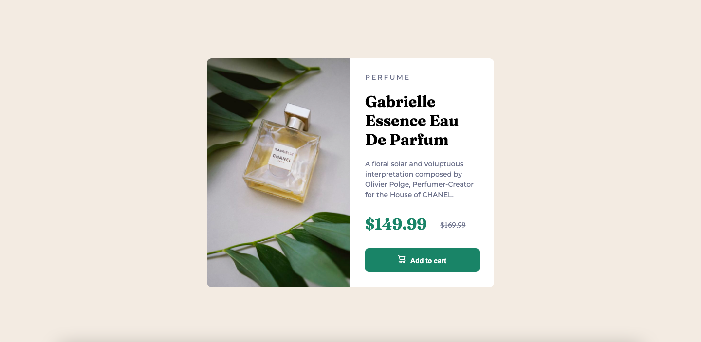

# Frontend Mentor - Product preview card component solution

This is a solution to the [Product preview card component challenge on Frontend Mentor](https://www.frontendmentor.io/challenges/product-preview-card-component-GO7UmttRfa). Frontend Mentor challenges help you improve your coding skills by building realistic projects.

## Table of contents

- [Overview](#overview)
  - [The challenge](#the-challenge)
  - [Screenshot](#screenshot)
  - [Links](#links)
- [My process](#my-process)
  - [Built with](#built-with)
  - [What I learned](#what-i-learned)
  - [Continued development](#continued-development)
  - [Useful resources](#useful-resources)
- [Author](#author)
- [Acknowledgments](#acknowledgments)

## Overview

### The challenge

Users should be able to:

- View the optimal layout depending on their device's screen size
- See hover and focus states for interactive elements

### Screenshot



### Links

- Solution URL: [https://github.com/moussadiakite/product_preview_card_component](https://github.com/moussadiakite/product_preview_card_component)
- Live Site URL: [https://moussadiakite.github.io/product_preview_card_component](https://moussadiakite.github.io/product_preview_card_component)

## My process

### Built with

- HTML5
- HTML5 picture tag
- CSS Media queries

### What I learned

I learned how to use media queries to build responsive design for both desktop and mobile. For example I used this media query to apply styles to the mobile version:

```css
@media screen and (max-width: 480px)  {

}
```

I also learned about the picture tag which helps you to handle multiple images with media queries:

```html
<picture class="product-image">
  <source media="(max-width:480px)" srcset="images/image-product-mobile.jpg" alt="chanel perfume">
  <source media="(min-width:480px)" srcset="images/image-product-desktop.jpg" alt="chanel perfume">
  
</picture>
```
Indeed using this instead of CSS is better for SEO.

### Continued development

This code has a Desktop-first workflow. I plan to redesign it using a Mobile-First workflow as it is better for SEO.

### Useful resources

- [W3 schools](https://www.w3schools.com/) - This helped me to find the documentation about the picture tag.

## Author

- Website - [Moussa DIAKITE](https://startling-cupcake-1159c8.netlify.app)
- Frontend Mentor - [@moussadiakite](https://www.frontendmentor.io/profile/moussadiakite)

## Acknowledgments

Thanks to Frontend Mentor for proposing this challenge.
